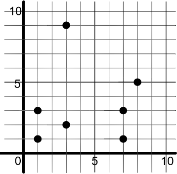
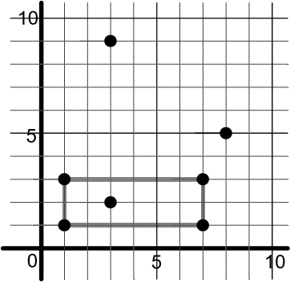

Assignment 1 - Zukei Puzzle
===========================

Description
-----------

In a Zukei puzzle, the player is given a set of seemingly random coordinates in
the Cartesian plane. The player must find a geometric shape whose vertices
are in the set. In this problem, the player must find only rectangles:

  Random coordinates?

  Nope, a rectangle!

Identify which vertices form rectangles in several Zukei puzzles given as input.
Assume that only one rectangle is hidden within each puzzle and that rectangle
sides are aligned with the X and Y axes - they are not rotated.

Input
-----
The first line contains the number of puzzles. Each of the following lines contain the information about a puzzle.  A puzzle line starts with the number of 2-D
vertices followed by pairs of integers for the vertex coordinates, listed in XY order. For example, the first puzzle in the example input below has 7 vertices. The first vertex is (1, 1), and the final vertex is (8, 5).

.. code-block:: text

  2
  7 1 1 7 1 7 3 1 3 3 9 3 2 8 5
  8 4 7 8 4 7 4 4 1 5 9 2 8 5 4 8 9

Output
------
For each puzzle, print to standard output a case label and the vertices that
form the rectangle in the puzzle. Lower vertices (i.e., smaller Y) appear before
higher ones. In the case of a tie, the vertex farther to the left (i.e.,
smaller X) is printed first. For the example input given above, the output is:

.. code-block:: text

  Case 1: 1 1 7 1 1 3 7 3
  Case 2: 5 4 8 4 5 9 8 9

Turn In
-------

Turn in a Java or Python file that will accept input via a file or ``stdio``, and
output the result via a file or ``stdout``.